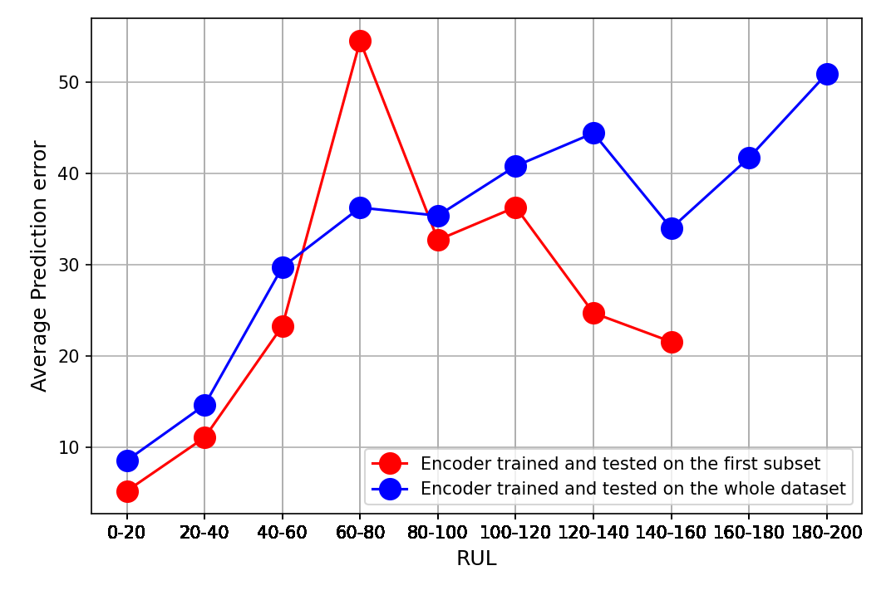
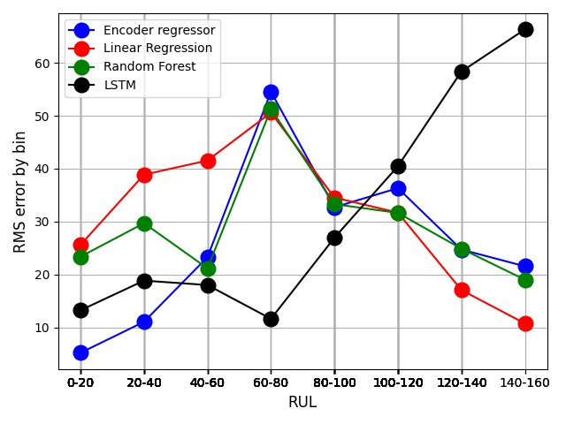

# Transformer-Based Time-to-Failure prediction for plane engine with NASA C-MAPSS multivariate timeseries

This repository contains the work, models, data and implementations of the project number 12 "Time-to-failure" of the course "Applied Data Science Project" at Politecnico di Torino. This project have been conducted by L. Suppa, [V. Perrucci](https://github.com/Vito-Perrucci) and [T. Dugas du Villard](https://github.com/Tanguy-ddv) (Students at Politecnico di Torino), within the supervision of C. M. Medoro and G. Rizzo from [The Links Foundation](https://linksfoundation.com/en/) during the first semester of the academic year 2024-2025.

## Abstract

Predicting the remaining useful lifetime of a machine is crucial to optimize predictive maintenance efficiency, safety and sustainability. As multiple approaches can be used to estimate this duration, this report introduces a transformerbased approach exploiting the potential of encoder regressors to catch the temporal evolution and patterns of multivariate time series. The performance of the encoder regressor model is evaluated against machine learning models, recurrent neural networks and other state-of-the-art models, demonstrating the ability of the solution to achieve a convincing accuracy on physical data extracted from a simulated aircraft engine.

## Algorithm

This project aims to develop an algorithm to predict the useful remaining lifetime (RUL) of a plane engine based on physical timeseries exctracted by sensors on the engine. The data used are from the [NASA Turbofan Jet Engine](https://www.kaggle.com/datasets/behrad3d/nasa-cmaps), simulated on C-MAPSS. The chosen solution comprises multiple steps, shortly described below and expansively described in [the report](report.pdf).

### Preprocessing

The data are first preprocessed by removing some of the features, considered as redondant or not carrying enough information. The feature selection have been carried with a backward elimination and the study of the correlation matrix. Then, a Savitzky-Golay filter is applied on each timeseries to remove some of the noise and enhance the performance of the algorithm by allowing the model to learn exclusively from the trend without being influenced by the noise. Finally, the timeseries are normalized thanks to a min-max scaler and separated in multiple windows. These windows will be the input of the model described below

### Encoder regressor

The model used to turn a window into a predicted RUL leverages the encoder part of transformers architecture. The encoder starts by learnable positional encoding, followed by multiple encoders with attention layers, feedforwards, residual connections and batch normalizations. Then, the model ends by a two-layers fully connected neural network whose output is a scalar: the predicted RUL. Its training is separated in two steps:
- First, a pretraining part is performed on the learnable positional encoding and the encoders. The final neural network is replaced by a fully connected layer with the same output dimension as the input. The input windows are randomly masked and the model is asked to reconstruct them. This encourages the encoder layers to learn contextual representations that capture both short- and long-range dependencies in the data. 
- Then, the last layer is replace the fully connected neural network and a finetuning starts. The ground truth being the RUL of the window passed as input.

### Postprocessing

The final step of the algorithm consist in aggregating the predictions produced by the encoder. Each window passed as input of the encoder is turned into a RUL relative to then end of the window. After aligning the predictions with the end of the trajectory, they are aggregated together with a two-steps algorithm:
- First, the predictions related to the last 20 windows (or all the windows if they are less than 20) are averaged to produce an estimation of the RUL. This estimation is not really precise, however, it is enough to determine whether the failure will occur in more or less than 20 timesteps. If it is less, then the final prediction is the average of the predictions related to the last 9 windows, otherwise, of the last 80 windows.

## Results

The algorithm developed during this project shows very convincing results. One encoder have been trained only on part of the dataset containing only one flight condition and one failure type, while a second have trained on the whole dataset, where there are multiple flight conditions and failures types. The results are shown below, where the error is shown with respect to the RUL (the ground truth) and aggregated by bins. 

The performances of the algorithm are particularly good on the first bin, corresponding for the short-term failures, on which a precise prediction is mandatory. The error stays relatively low for longer-term failures. The model is also able to predict correclty the RUL even with various flight conditions and failure types.

Compared to other model on the first subset, the algorithm is very suitable for short-term predictions, while an LSTM is able to perform better on medium-term failures and linear regressions are enough to get good results on long-term, as shown below.

## How to use ?

The project requires the installation of several external libraries, reported in [the requirement file](requirements.txt). You can simply install all of them by running ``pip install -r requirements.txt`` in a terminal or run the first cell of the notebook.

The project, as is, already include several models trained with different hyperparameters. You can call them by running the [software notbeook](software.ipynb). To do so, you simply have to chose the model, hyperparameters and whether you want to train a new model or not, in the second cell. You can now just run the whole notebook at wait for it to finish.
